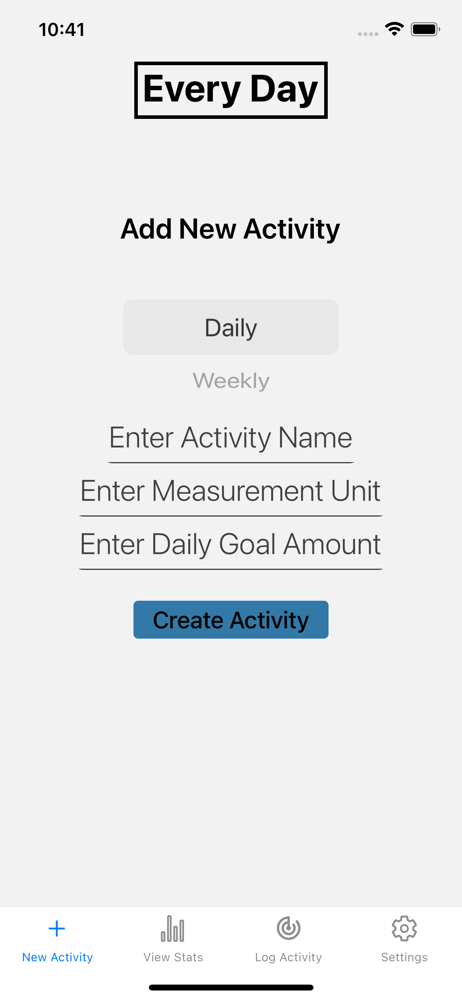
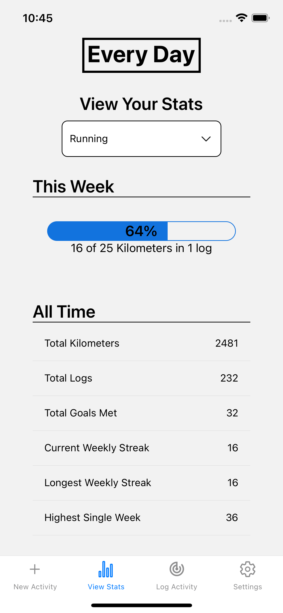
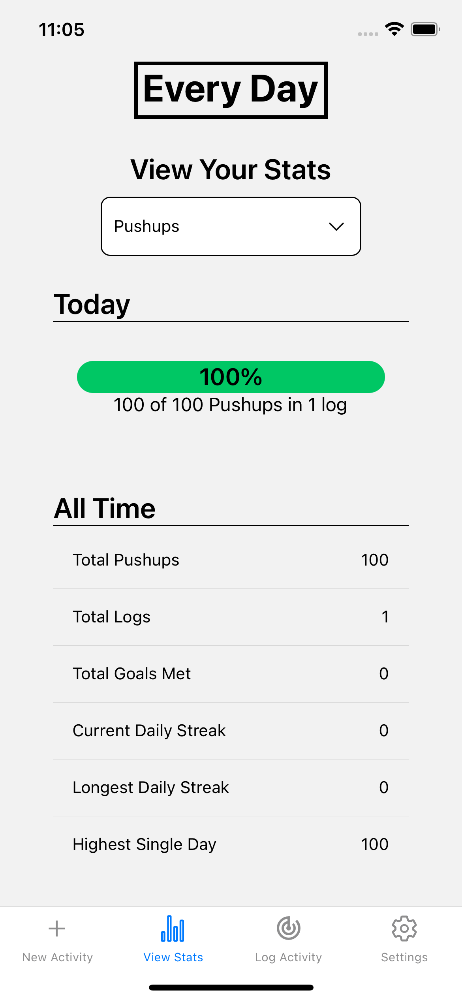
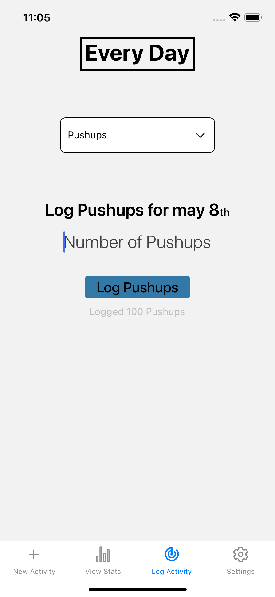

# Every Day

Daily or weekly habit tracking mobile app which takes numeric input.  
Currently tested only on iOS.

Built Using [React Native](https://reactnative.dev) 

Startup (iOS): `npm install && npx pod-install && npx run-ios`